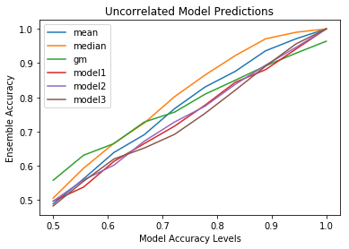

There are lots of ways to ensemble the outputs of models. I was wondering what is the best way to ensemble ?

In this project, I consider three simple and most commonly used ensembling approaches
1. Taking mean of the predictions.
1. Taking median of the predictions.
1. Taking Geometric mean of predictions.

In practical scenarios use different algorithms on the same dataset. So, the model predictions are likely to be correlated with each other. I wanted to simulate this case so i wrote a function 'gen_preds' that  tries to generate a new set of predictions which will be correlated with the given model and also have a similar accuracy.
After these correlated predictions were generated, I tried the above mentioned ensembling techniques at different accuracy levels. The attempt is to answer the question that given the accuracy of our model predictions which will be the best ensembling technique ?

I performed the experiment for the binary case and ensembled the predictions of three uncorrelated models.
Taking the median of the models seems to give the best result in this scenario when models have accuracy above 60 %.

I perfomed similar experiment after generating correlated predictions. In this case there was no clear winner. However, taking the geometric mean of predictions didn't seem to give good results.

You can run [the notebook](https://www.kaggle.com/meaninglesslives/finding-the-best-way-to-ensemble/) on kaggle. I find this topic to be fascinating. This is just a simple demonstration and starter project. I believe one can rerun the experiment lets say 10000 times to get a more support for the conclusion.
If you are interested and would like to discuss this further, please feel free to contact me :-)